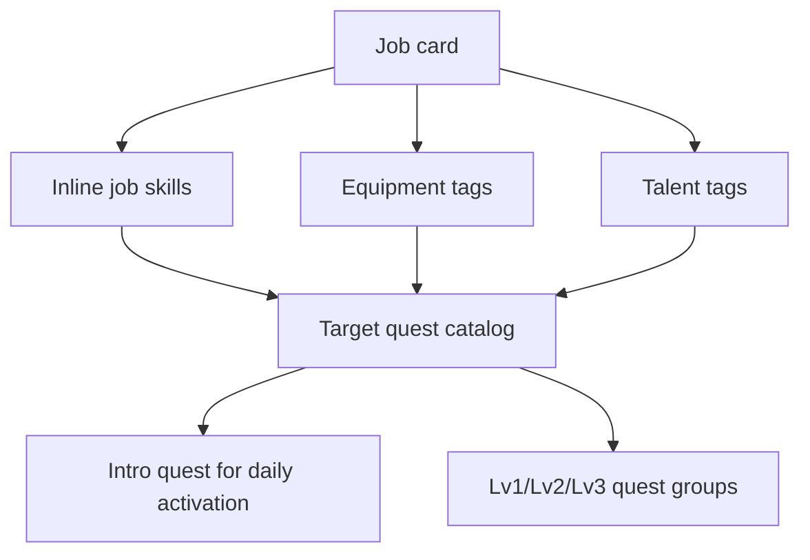

# feat: Add Target Quest Data Catalog

## Summary

Create a target-owned quest data catalog that Codex can author and Claude can render later. The catalog will define intro quests and three required quests per level for skill, equipment, and talent targets without duplicating quest content per job.

---

## Problem Frame

The existing quest data is per-job and the app already has separate shared concepts for skills, equipment, and talents. Planning must establish a data-first handoff that preserves the new target-owned model from the origin document while keeping legacy per-job quest content from confusing future work.

---

## Requirements

- R1. Quest content is owned by progression targets, not jobs. (see origin: `docs/brainstorms/target-quest-system-requirements.md`)
- R2. A target can be a skill, equipment item, or talent. (see origin: `docs/brainstorms/target-quest-system-requirements.md`)
- R3. Jobs only determine available target pools through skill lists and equipment/talent tags. (see origin: `docs/brainstorms/target-quest-system-requirements.md`)
- R4. Each target has one intro quest for daily activation. (see origin: `docs/brainstorms/target-quest-system-requirements.md`)
- R5. Each target has exactly three required main quests for Lv1, Lv2, and Lv3. (see origin: `docs/brainstorms/target-quest-system-requirements.md`)
- R6. Quest completion requires summary evidence, but UI and level-up behavior are outside Codex's data-only slice. (see origin: `docs/brainstorms/target-quest-system-requirements.md`)
- R7. The first delivery should prove the model with at least one skill, one equipment item, and one talent. (see origin: `docs/brainstorms/target-quest-system-requirements.md`)
- R8. Claude-side UI should render Codex-owned quest data rather than embed duplicated quest copy. (see origin: `docs/brainstorms/target-quest-system-requirements.md`)

**Origin actors:** A1 Player, A2 Quest data author, A3 Codex, A4 UI implementer
**Origin flows:** F1 Daily intro activation, F2 Main quest level progression, F3 Reusable quest authoring
**Origin acceptance examples:** AE1, AE2, AE3, AE4, AE5

---

## Scope Boundaries

- No UI/UX design work.
- No implementation of level-up logic or quest completion interaction.
- No mission or vending work.
- No per-job duplicated target quest data.
- No attempt to author every skill, equipment item, and talent in the first slice.
- No destructive removal of existing per-job quest files in this plan; legacy reconciliation is documented and deferred.

### Deferred to Follow-Up Work

- Full catalog expansion: after the seed catalog validates, create batches for all skills, equipment, and talents.
- Runtime UI integration: Claude-side work should render target quests, daily activation, level quest groups, completion summaries, and archive/history.
- Legacy per-job quest migration/removal: decide after target quest data is available and UI no longer depends on old per-job files.

---

## Context & Research

### Relevant Code and Patterns

- `data/equipment.json` and `data/talents.json` already provide external JSON catalogs with `id`, `name`, descriptions, and `tags`.
- `index.html` stores equipment/talent progress under `equip::<id>` and `talent::<id>`.
- `index.html` stores skill progress by skill name under `skill::<skill-name>`.
- `index.html` still defines job skill lists inline in the `jobs` array.
- `data/quests/index.json` and `data/quests/*.json` are the legacy per-job quest path and should not be extended for the new target-owned model.
- `scripts/validate-quests.mjs` demonstrates the repo's current JSON validation style.

### Institutional Learnings

- No `docs/solutions/` guidance was found for this area during prior quest planning.

### External References

- No external framework research is needed. This is local static JSON data, validation, and content authoring.

---

## Key Technical Decisions

- Use a new target quest catalog instead of extending `data/quests/`: `data/quests/` is job-shaped legacy data, while target quests need a different ownership model.
- Use sidecar quest data rather than embedding full quest arrays directly into `data/equipment.json` and `data/talents.json`: target ownership is logical, and sidecar files keep equipment/talent catalogs readable while still referencing stable target IDs.
- Use explicit target identity with kind plus ID/name: equipment and talent already have stable IDs, while skills currently need a normalized ID derived from the skill name until skills are moved to a dedicated data file.
- Keep intro and level quests in the same target record: Claude needs one place to load all quest copy for a target.
- Validate structure before expanding content: a small seed set catches schema and handoff mistakes before hundreds of target quest records are authored.

---

## Open Questions

### Resolved During Planning

- Where should target quest ownership live? Logically on skill/equipment/talent targets; physically in a sidecar target quest catalog to avoid bloating existing catalogs.
- What is the seed scope? At least one skill, one equipment item, and one talent, matching origin R17.
- Should the old per-job quest data be removed now? No. It remains legacy/transitional until UI and data consumers move to the target-owned model.

### Deferred to Implementation

- Exact seed target choices: choose well-known examples already present in current data, preferably one shared skill, Visual Studio Code or Git as equipment, and one frontend or backend talent.
- Exact source links: choose stable official docs or reputable learning references while authoring the seed quest content.
- Whether a later phase moves inline skill definitions out of `index.html`: not required for the seed catalog, but the target inventory should make that future migration easier.

---

## Output Structure

    data/
      target-quests/
        index.json
        skills.json
        equipment.json
        talents.json
    scripts/
      validate-target-quests.mjs
    docs/
      plans/
        2026-05-13-013-feat-target-quest-data-plan.md

---

## High-Level Technical Design

> *This illustrates the intended approach and is directional guidance for review, not implementation specification. The implementing agent should treat it as context, not code to reproduce.*

The new catalog should answer one question for Claude: "Given this target kind and target ID, what intro quest and level quest groups should be rendered?"

---

## Implementation Units

- U1. **Define Target Inventory and ID Convention**

**Goal:** Establish a canonical inventory of questable targets and a collision-safe identifier convention across skills, equipment, and talents.

**Requirements:** R1, R2, R3, R7

**Dependencies:** None

**Files:**
- Create: `data/target-quests/index.json`
- Test: none

**Approach:**
- Create a target quest index that lists available target quest files by kind.
- Represent target identity as kind plus target ID so similarly named skill/equipment/talent entries cannot collide.
- For equipment and talent, reference existing `id` values from `data/equipment.json` and `data/talents.json`.
- For skills, derive stable IDs from current skill names and preserve the original display name so existing `skill::<name>` progress remains understandable.

**Patterns to follow:**
- `data/equipment.json`
- `data/talents.json`
- `scripts/validate-quests.mjs`

**Test scenarios:**
- Test expectation: none -- this unit only establishes the index shape; executable validation is added in U2 and exercised after U3 creates seed files.

**Verification:**
- Target quest index declares skill, equipment, and talent quest file entries using the agreed target kind naming.

---

- U2. **Create Target Quest Schema Validator**

**Goal:** Add validation rules for intro quests and level quest groups so content authors cannot accidentally produce incomplete target quest sets.

**Requirements:** R4, R5, R6, R8

**Dependencies:** U1

**Files:**
- Create: `scripts/validate-target-quests.mjs`
- Test: `scripts/validate-target-quests.mjs`

**Approach:**
- Validate that every target record has exactly one intro quest.
- Validate that every target record has Lv1, Lv2, and Lv3 quest groups.
- Validate that each level group has exactly three main quests.
- Validate that every quest has title, description/task copy, summary-required semantics, and at least one usable HTTP/HTTPS source link.
- Validate target references against current source catalogs: skills from `index.html`, equipment from `data/equipment.json`, and talents from `data/talents.json`.

**Patterns to follow:**
- `scripts/validate-quests.mjs`

**Test scenarios:**
- Happy path: one valid skill, equipment, and talent target pass.
- Covers AE2. Happy path: intro quest exists for an inactive target candidate.
- Covers AE3. Error path: a level group with only two quests fails validation.
- Error path: target kind is unknown.
- Error path: equipment target ID does not exist in `data/equipment.json`.
- Error path: talent target ID does not exist in `data/talents.json`.
- Error path: skill target display name does not exist in any job skill list.
- Error path: quest source URL is malformed or missing.

**Verification:**
- Validator fails loudly on incomplete target quest data and passes the seed catalog.

---

- U3. **Author Representative Seed Quest Content**

**Goal:** Provide enough real target quest data to prove the model across all three target kinds.

**Requirements:** R1, R2, R4, R5, R6, R7, R8

**Dependencies:** U1, U2

**Files:**
- Create: `data/target-quests/skills.json`
- Create: `data/target-quests/equipment.json`
- Create: `data/target-quests/talents.json`
- Test: `scripts/validate-target-quests.mjs`

**Approach:**
- Pick one shared skill target, one equipment target, and one talent target that already exist in the app data.
- For each target, author one intro quest for daily activation.
- For each target, author three Lv1 quests, three Lv2 quests, and three Lv3 quests.
- Keep quest framing generic to the target rather than a specific job.
- Prefer stable official docs or mature learning references; do not use weak filler links just to satisfy counts.

**Execution note:** Content quality matters more than speed; review each seed target for generic reuse before expanding.

**Patterns to follow:**
- `data/equipment.json`
- `data/talents.json`
- `docs/brainstorms/target-quest-system-requirements.md`

**Test scenarios:**
- Covers AE1. Happy path: a talent used by multiple jobs has one quest set that can be reused.
- Covers AE2. Happy path: equipment intro quest teaches first contact with the tool.
- Covers AE3. Happy path: every target has three quests for Lv1, Lv2, and Lv3.
- Covers AE4. Happy path: quest descriptions do not reference a single job unless the target itself is job-specific.
- Covers AE5. Happy path: every quest is written so a summary can reasonably be produced after completion.

**Verification:**
- Seed target quest files pass validation and are readable by a future UI implementer without needing product interpretation.

---

- U4. **Document Legacy Quest Reconciliation**

**Goal:** Prevent future agents from mixing the old per-job quest model with the new target-owned model.

**Requirements:** R1, R3, R8

**Dependencies:** U1, U2, U3

**Files:**
- Modify: `docs/brainstorms/quest-system-requirements.md`
- Modify: `docs/plans/2026-05-12-011-feat-quest-system-data-plan.md`
- Test: none

**Approach:**
- Add a short note to the older quest documents that the target-owned model supersedes future quest data authoring.
- Do not delete old job quest files yet.
- Make clear that old per-job quest content is transitional and should not be expanded for new content batches unless the user explicitly reverts the product decision.

**Patterns to follow:**
- Existing docs under `docs/brainstorms/`
- Existing docs under `docs/plans/`

**Test scenarios:**
- Test expectation: none -- documentation-only change.

**Verification:**
- A reader can tell which quest model is current and which content path is legacy.

---

- U5. **Prepare Claude Handoff Notes**

**Goal:** Give Claude enough data contract context to build UI without embedding quest copy or re-deciding ownership.

**Requirements:** R6, R8

**Dependencies:** U1, U2, U3

**Files:**
- Create: `docs/handoffs/target-quest-data-for-claude.md`
- Test: none

**Approach:**
- Summarize target ownership, intro quest purpose, main quest level groups, completion summary expectation, and legacy per-job caveat.
- Include example target references and counts from the seed catalog.
- Keep this as handoff guidance, not UI design.

**Patterns to follow:**
- `docs/brainstorms/target-quest-system-requirements.md`

**Test scenarios:**
- Test expectation: none -- handoff documentation only.

**Verification:**
- Claude can use the handoff doc to render target quest data without copying quest content into UI code.

---

## System-Wide Impact

- **Interaction graph:** Data authoring shifts from job quest files to target quest files. Existing card/detail UI can remain untouched until Claude integrates the new catalog.
- **Error propagation:** Validator failures should block incomplete content before UI work consumes it.
- **State lifecycle risks:** Existing skill/equip/talent progress keys must remain understandable; the new quest catalog should not require destructive progress migration.
- **API surface parity:** Export/showcase, sync/import/export, and future Claude UI may eventually need to read target quest completion records, but this plan only prepares data and validation.
- **Integration coverage:** The seed catalog must prove all three target kinds so UI integration does not overfit to one kind.
- **Unchanged invariants:** Equipment and talent tags remain job relevance sources. Existing per-job quest files remain available until explicitly migrated or removed.

---

## Risks & Dependencies

| Risk | Mitigation |
|------|------------|
| Quest data explodes in size once every target gets 10 quests | Start with validated seed content and expand in batches by target kind/category. |
| Skill targets lack stable IDs because skills are still inline strings | Use normalized IDs plus original display names; defer full skill data extraction until needed. |
| Future agents keep expanding old per-job quests | Add legacy reconciliation notes and Claude handoff guidance. |
| Quest content becomes too generic to be useful | Require target-specific intro and level tasks with real source links and summary-worthy outcomes. |
| Claude UI embeds copy instead of loading Codex data | Provide a handoff doc and keep the data contract explicit. |

---

## Documentation / Operational Notes

- This plan is data/content focused. UI, visual states, and interaction design are intentionally left for Claude-side work.
- The new target quest catalog should be validated independently from legacy `data/quests/` files.
- Later expansion should likely happen in batches: shared skills first, high-use equipment second, high-use talents third, then long-tail categories.

---

## Sources & References

- **Origin document:** `docs/brainstorms/target-quest-system-requirements.md`
- Related legacy requirements: `docs/brainstorms/quest-system-requirements.md`
- Related legacy plan: `docs/plans/2026-05-12-011-feat-quest-system-data-plan.md`
- Related UI plan: `docs/plans/2026-05-13-012-feat-card-actions-tabbed-modal-plan.md`
- Related data: `data/equipment.json`
- Related data: `data/talents.json`
- Related legacy quest data: `data/quests/index.json`
- Related validator pattern: `scripts/validate-quests.mjs`
