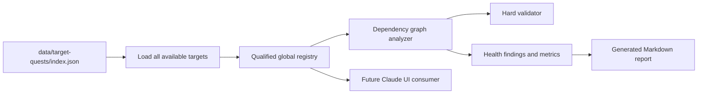

# Fundamental Dependency Graph Implementation Plan

## Summary

Turn the existing empty `prerequisiteTargets` fields into a complete cross-catalog learning graph. A shared dependency analyzer will enforce the contract for both hard validation and health reporting before all 429 dependent targets are authored and handed off for future Claude-owned UI consumption.

---

## Problem Frame

The target quest catalog contains 551 targets and 5,510 quests, but all prerequisite arrays are empty. The existing `fundamental` flag can sort introductory daily quests, yet it cannot express the foundations required before a dependent skill, equipment item, or talent becomes ready to introduce (see origin: `docs/brainstorms/fundamental-dependency-graph-requirements.md`).

Sixteen raw target IDs occur in more than one catalog, so dependency identity cannot safely use an unqualified ID. The graph must also be validated globally because valid learning paths often cross skill, equipment, and talent boundaries.

---

## Requirements

### Reference Identity

- R1. Require `<kind>:<targetId>` references.
- R2. Permit qualified references across skill, equipment, and talent catalogs.

### Graph Integrity

- R3. Keep every fundamental target prerequisite-free.
- R4. Give every non-fundamental target one to three direct prerequisites.
- R5. Require every reference to resolve, be unique, and not reference its own target.
- R6. Require one globally acyclic graph.
- R7. Require every dependent target to reach at least one fundamental root transitively.

### Readiness and Authoring

- R8. Treat direct prerequisites as AND requirements at level 1. Resolve a skill's effective level as the maximum across matching job-scoped and legacy shared progress keys; resolve equipment and talent through their global source progress keys. Keep referenced prerequisites eligible for activation outside normal job-tag discovery.
- R9. Use the smallest credible conceptual or operational foundations and review every authored edge semantically.

### Validation, Reporting, and Handoff

- R10. Report malformed, unresolved, duplicate, self, missing, excessive, cyclic, and unrooted dependencies as errors.
- R11. Report dependency edge count, maximum depth, and missing authored prerequisites deterministically.
- R12. Document the consumer contract without prescribing UI layout or interaction design.

### Plan Constraints

- Keep target identity, progress keys, `fundamental`, `learningStage`, quest copy, quest links, intro objects, and level groups unchanged.

---

## Scope Boundaries

### Included

- Shared dependency parsing, graph analysis, deterministic findings, and metrics.
- Dependency authoring in all available target quest catalogs.
- Hard validation, health reporting, tests, generated report, and Claude handoff updates.

### Excluded

- `index.html`, daily-quest selection behavior, progress persistence, cards, modals, or visual design.
- Changes to `intro` or `levels: { "1": [...], "2": [...], "3": [...] }`.
- New jobs, targets, quests, equipment, talents, or learning sources.
- Broad cleanup of existing source-concentration warnings.

### Deferred to Follow-Up Work

- Claude-owned runtime consumption of the graph for daily-quest eligibility.
- User-facing explanations of why a target is locked or which prerequisite remains incomplete.

---

## Context & Research

### Relevant Code and Patterns

- `data/target-quests/index.json` defines the available catalog files and kinds.
- `scripts/lib/target-quest-health.mjs` already centralizes deterministic catalog analysis and stable findings.
- `scripts/validate-target-quests.mjs` is the hard repository validation gate.
- `scripts/target-quest-health.test.mjs` uses temporary fixtures and Node's built-in test runner.
- `docs/reports/target-quest-health.md` is a deterministic generated snapshot without timestamps.

### Institutional Learnings

- Earlier target-quest planning already treats kind plus target ID as collision-safe identity.
- Validate graph semantics with fixtures before bulk authoring, then validate all catalogs together.
- Hard validation remains authoritative while health reporting remains explanatory; both must share one graph implementation.
- The handoff must distinguish single-colon graph references from double-colon progress keys.

### External References

- No external dependency or framework research is needed; the repository uses dependency-free Node ESM and standard graph algorithms.

---

## Assumptions

- Current `fundamental` and `learningStage` classifications remain unchanged unless implementation finds an impossible contradiction and documents it explicitly.
- One direct prerequisite is preferred; two or three are used only for targets that genuinely combine independent foundations.
- Graph depth is zero for fundamentals and one plus the greatest direct-prerequisite depth for dependents because direct prerequisites use AND semantics.
- Only targets in files marked `available` by `data/target-quests/index.json` participate in the active graph.
- Malformed or unresolved edges are excluded from traversal so one bad reference cannot produce misleading cycle or depth results.
- Dependency metrics use resolved, unique, non-self edges. `maxDepth` is an integer only for a complete rooted DAG and `null` when analysis is incomplete, cyclic, or unrooted.
- Job tags govern normal target discovery, but graph references may expose prerequisites across job boundaries so dependencies remain semantically correct and satisfiable.

---

## Key Technical Decisions

- Introduce one pure graph analyzer under `scripts/lib/` and consume it from both validation and health reporting to prevent semantic drift.
- Represent an edge from a target to its direct prerequisite; do not repeat transitive ancestors in authored arrays.
- Detect cycles globally and emit canonically sorted findings so repeated runs are byte-stable.
- Run cycle and rootedness analysis before depth calculation; never attempt recursive depth calculation for an invalid graph.
- Suppress cascading graph findings when any available catalog cannot load. Emit one `dependency-analysis-incomplete` error and null dependency metrics alongside the original loader error.
- Increment the machine-readable health report version because dependency metrics extend its JSON contract.
- Preserve two-space JSON formatting, alphabetical target order, and all non-dependency content in the large catalog files.

---

## High-Level Technical Design

> This diagram is directional guidance. Implementation may choose the simplest standard graph traversal that preserves these boundaries and deterministic outputs.

---

## Implementation Units

- U1. **Build the shared dependency analyzer**

**Goal:** Establish the qualified-reference and graph semantics before catalog authoring.

**Requirements:** R1-R7, R10-R11

**Dependencies:** None

**Files:**
- Create: `scripts/lib/target-quest-graph.mjs`
- Create: `scripts/target-quest-graph.test.mjs`

**Approach:**
- Analyze normalized targets from all available catalogs as one registry.
- Validate strict reference syntax, resolution, uniqueness, self-reference, count bounds, fundamental constraints, cycles, and rootedness.
- Return deterministic findings plus valid edge count, nullable maximum depth, and dependent targets lacking authored prerequisites.

**Execution note:** Test-first; graph edge cases should be fixed against small fixtures before bulk data changes.

**Patterns to follow:**
- Pure analysis and stable finding shape in `scripts/lib/target-quest-health.mjs`.
- Built-in `node:test` fixtures in `scripts/target-quest-health.test.mjs`.

**Test scenarios:**
- Happy path: a valid cross-kind DAG with colliding raw IDs resolves by qualified kind and reports the expected edges and depth.
- Error path: unqualified, double-colon, unknown-kind, empty-ID, non-string, and extra-separator references produce stable syntax findings.
- Error path: duplicate, unresolved, self, missing, and more-than-three prerequisite declarations produce their corresponding findings.
- Error path: cross-kind cycles and dependent chains without a fundamental root are detected deterministically.
- Error path: cyclic, unrooted, or incomplete graphs report `maxDepth` as unavailable instead of recursing or emitting a misleading number.
- Edge case: repeated analysis of the same target set serializes identically.

**Verification:**
- The analyzer has no filesystem or UI dependency and its focused suite covers all graph rule classes.

---

- U2. **Author all catalog dependencies**

**Goal:** Populate a semantically credible learning graph for all 429 dependent targets.

**Requirements:** R1-R9

**Dependencies:** U1

**Files:**
- Modify: `data/target-quests/skills.json`
- Modify: `data/target-quests/equipment.json`
- Modify: `data/target-quests/talents.json`
- Test: `scripts/target-quest-graph.test.mjs`

**Approach:**
- Clarify qualified-reference syntax in each embedded schema description.
- Keep every fundamental array empty and give every dependent one to three direct foundations, preferring one.
- Use cross-kind references when the real prerequisite belongs to another catalog; do not infer progress keys from graph references.
- Split authoring into skill (158), equipment (126), and talent (145) batches. For skills, use tooltip descriptions and job/tier context; for equipment and talents, use bilingual catalog descriptions and job tags. Use authoritative technology documentation only when local evidence is insufficient.
- Record every target, direct prerequisite, and concise smallest-foundation rationale in per-kind ledgers under `docs/reports/dependency-review/`, indexed by `docs/reports/target-dependency-review.md`. Review every edge for foundation fit and every multi-edge target for independent necessity before integration.
- Before bulk authoring, capture temporary SHA-256 baselines of each catalog after removing only `prerequisiteTargets` and the intentionally changed schema description. Compare after authoring and assert exact per-target `fundamental` and `learningStage` preservation.
- Add live-catalog invariants for totals, exact classification identity, graph validity, and preservation of quest structure.

**Patterns to follow:**
- Alphabetical target order and trailing metadata field order already used by all three catalogs.
- Catalog descriptions and tags as authoring evidence; generic quest links do not determine dependencies.

**Test scenarios:**
- Integration: all 551 targets and 5,510 quests still load after dependency authoring.
- Happy path: all 122 fundamentals remain empty and all 429 dependents have one to three references.
- Integration: every edge resolves globally, the graph is acyclic, and every dependent reaches at least one fundamental.
- Regression: target IDs, names, source objects, intro quests, level quests, links, and progress keys are unchanged.
- Regression: temporary normalized catalog digests match their pre-authoring baselines and each target retains its original `fundamental` and `learningStage` values.
- Semantic acceptance: every authored edge has a review-ledger rationale and every multi-edge target explains why each prerequisite is independently necessary.

**Verification:**
- Full-catalog graph validation passes with zero graph errors and zero missing dependent prerequisites.

---

- U3. **Integrate validation and health reporting**

**Goal:** Make the graph contract enforceable and observable through existing repository tooling.

**Requirements:** R10-R11

**Dependencies:** U1, U2

**Files:**
- Modify: `scripts/validate-target-quests.mjs`
- Modify: `scripts/lib/target-quest-health.mjs`
- Modify: `scripts/target-quest-health.test.mjs`
- Test: `scripts/target-quest-graph.test.mjs`

**Approach:**
- Collect available targets before graph analysis so cross-file references resolve correctly.
- Map graph violations to hard validator failures and health-report errors using shared rule IDs.
- Add dependency metrics to JSON, text, and Markdown output while retaining existing CLI arguments and source warnings.
- If any declared available catalog fails to load, retain the loader finding, emit one incomplete-analysis error, null graph-wide metrics, and suppress derivative unresolved/cycle/rootedness findings.

**Patterns to follow:**
- Existing stable sorting, fixture construction, output formatting, and threshold behavior in target quest health tooling.

**Test scenarios:**
- Happy path: a healthy cross-kind fixture reports edge count, depth, and zero missing authored prerequisites.
- Error path: each graph rule is an error and triggers the existing error threshold.
- Error path: missing, malformed, and invalid-shape catalogs produce one incomplete-analysis finding without cascading graph errors.
- Integration: text, JSON, and Markdown expose equivalent dependency metrics.
- Regression: existing structural, identity, localization, source, CLI, and deterministic-output tests continue passing.

**Verification:**
- `scripts/validate-target-quests.mjs` passes the complete catalog and health output remains deterministic.

---

- U4. **Regenerate durable outputs and handoff**

**Goal:** Publish the final graph health and a precise data contract for Claude's future UI work.

**Requirements:** R11-R12

**Dependencies:** U3

**Files:**
- Modify: `docs/reports/target-quest-health.md`
- Create: `docs/reports/target-dependency-review.md`
- Create: `docs/reports/dependency-review/skills.md`
- Create: `docs/reports/dependency-review/equipment.md`
- Create: `docs/reports/dependency-review/talents.md`
- Modify: `docs/handoffs/target-quest-data-for-claude.md`

**Approach:**
- Regenerate the tracked health report only after data and graph integration are final.
- Replace stale seed counts in the handoff and document qualified references, cross-kind resolution, AND semantics, cross-job prerequisite activation, shared effective skill levels, global equipment/talent levels, level-1 readiness, and unchanged level-2/3 progression.
- Restate that UI layout and interaction design remain Claude-owned.

**Test scenarios:**
- Integration: regenerating the report a second time produces no diff.
- Documentation: report totals match 551 targets and 5,510 quests, with zero graph errors and zero missing dependencies.
- Documentation: the semantic review ledger covers every dependent target and every direct edge.
- Documentation: handoff clearly distinguishes `equipment:<id>` graph references from runtime progress keys using `equip::<id>`.

**Verification:**
- Generated output and handoff agree with the analyzer's final contract and metrics.

---

## System-Wide Impact

- **Interaction graph:** Catalog JSON feeds the shared graph analyzer, which feeds validator and health outputs; future UI consumption reads the same authored fields but is not implemented here.
- **Error propagation:** Invalid graph data fails the hard validator and appears as an error in health reports.
- **State lifecycle risks:** No user progress or localStorage data changes; this is static catalog metadata.
- **API surface parity:** Text, JSON, and Markdown health formats receive equivalent dependency metrics.
- **Integration coverage:** Full-catalog tests prove cross-file references, cycles, rootedness, and unchanged target/quest totals.
- **Unchanged invariants:** Quest schema levels, summaries, links, target identity, and progress keys remain unchanged.

---

## Risks & Dependencies

| Risk | Mitigation |
|------|------------|
| Structurally valid but weak semantic dependencies | Prefer one direct prerequisite and review every multi-edge target for independent necessity. |
| Cross-catalog cycle introduced during parallel authoring | Validate the merged three-file graph after every catalog integration and before report generation. |
| Validator and health semantics diverge | Both consume one pure graph analyzer and shared rule IDs. |
| Large data diff changes unrelated quest content | Add preservation assertions and restrict edits to schema descriptions plus prerequisite arrays. |
| Generated report becomes stale | Regenerate last and verify a second generation is diff-free. |

---

## Documentation / Operational Notes

- No deployment, migration, package installation, or UI update is required.
- The health report version change should be called out in the PR because machine consumers may inspect its JSON shape.
- `favicon-preview.png` is unrelated and must remain untracked and untouched.

---

## Sources & References

- **Origin document:** `docs/brainstorms/fundamental-dependency-graph-requirements.md`
- Ideation source: `docs/ideation/2026-07-22-surprise-me-ulong-rpg.md`
- Existing analyzer: `scripts/lib/target-quest-health.mjs`
- Existing tests: `scripts/target-quest-health.test.mjs`
- Consumer handoff: `docs/handoffs/target-quest-data-for-claude.md`
