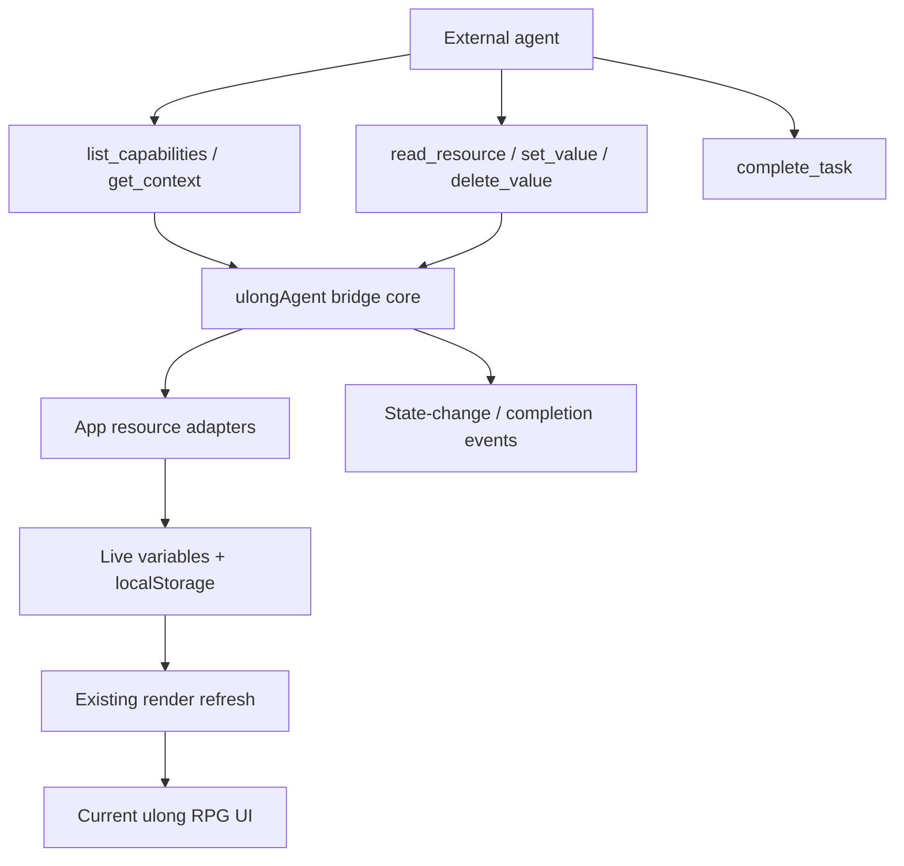

# Agent-Native Progress Bridge Plan

## Summary

Expose ulong RPG's existing local state through a small set of atomic, composable browser primitives so an external agent can inspect context, update the same data the UI uses, observe the result immediately, and explicitly signal completion. The existing AUTO prompt will describe this bridge and inject current app context instead of treating the agent as a passive quest-guide chatbot.

This is a logic-only agent integration. It does not add a chat panel, redesign any screen, call a model API, or take UI ownership from Claude.

---

## Problem Frame

ulong RPG currently has an AUTO button that copies progress into a prompt, but the receiving agent has no first-class way to act on the application. It can explain what the player should do, while every state-changing outcome still requires manual UI clicks or ad hoc localStorage manipulation.

The app already has a shared state boundary: load/save functions around localStorage followed by render refreshes. A browser bridge can turn that boundary into atomic agent capabilities without adding an agent runtime or encoding quest strategy in code.

---

## Requirements

- R1. Publish a versioned `window.ulongAgent` bridge after application initialization.
- R2. Provide atomic primitives for capability discovery, context reading, resource reading, path-level setting, path-level deletion, and explicit task completion.
- R3. Keep agent and UI state in parity by routing writes through the app's existing save functions and refreshing affected UI immediately.
- R4. Cover every mutable local user-state resource that currently has a UI or sync behavior: progress, quest progress, profile, links, AUTO preference, language, job change, guild, achievements, and Perguruan Ulong progress.
- R5. Return deep-cloned snapshots so agent-side mutation cannot silently alter live state.
- R6. Reject unknown resources, invalid paths, unsafe prototype keys, unsupported values, and stale write revisions without partial mutation.
- R7. Emit a structured browser event after successful writes/deletes and after explicit completion.
- R8. Generate dynamic agent context using current jobs, known resources, capability names, revision, and live progress summaries.
- R9. Update the AUTO prompt to describe outcomes and available primitives, leaving prioritization and quest guidance to agent judgment.
- R10. Maintain an action-parity map and automated parity/outcome tests.
- R11. Keep all visible layout, cards, controls, and showcase output unchanged.

---

## Scope Boundaries

### Included

- Browser-global agent bridge backed by existing in-memory state and save functions.
- Generic JSON path read/write/delete operations over registered resources.
- Optimistic revision checks for agent writes.
- Dynamic context and prompt generation.
- State-change and completion events.
- Capability map, unit tests, integration tests, and browser verification.

### Excluded

- Embedded chat UI or model/provider integration.
- MCP server, remote API, background agent loop, or autonomous scheduling.
- Self-modifying code or prompts.
- Automatic quest selection, grading, or level-up policy in bridge code.
- New visual controls, confirmations, dialogs, or styling.
- Direct access to browser data outside ulong RPG's registered resources.

### Deferred to Follow-Up Work

- A Claude-designed conversational surface that consumes the bridge.
- Approval UI for high-impact bulk operations.
- Persistent agent session memory and checkpoint/resume.
- External MCP wrapping if agents need access without a browser session.

---

## Context & Research

### Relevant Code and Patterns

- `index.html` defines all localStorage keys plus paired load/save functions for player state.
- Mutable module variables (`progress`, `questProgress`, `links`, `jobChangeState`, `achievements`, `ulongProgress`) are the same values current UI handlers update.
- `refreshCards()`, `renderPyramid()`, `renderProfileChip()`, and detail-tab invalidation are existing UI synchronization paths.
- `buildExportPayload()` and `applyImportPayload()` already prove that progress and quest progress can move through a structured data boundary.
- `buildAutoPrompt()` is the existing agent-facing seam, but its current snapshot parsing does not expose capabilities or a write path.
- `scripts/export-readme.test.mjs` demonstrates extraction/integration testing for behavior embedded in `index.html`.

### Agent-Native References Applied

- **Parity:** every registered UI-backed state resource receives read, set, and delete outcomes through generic primitives.
- **Granularity:** the bridge exposes state primitives, not workflow tools such as `choose_next_quest` or `level_up_everything`.
- **Composability:** new agent outcomes should usually require prompt changes or primitive composition, not new bridge methods.
- **Emergent capability:** agents can inspect context and compose mutations for requests not explicitly modeled as features.
- **Shared data store:** bridge adapters invoke the same save functions and refresh paths as UI actions.
- **Agent-to-UI events:** successful changes emit events after persistence and render refresh.
- **Outcome testing:** tests verify resulting app state and parity rather than a prescribed call sequence.

### External Dependencies

- None. The bridge is vanilla JavaScript and must work in the existing static hosting model.

---

## Assumptions

- The external agent can execute JavaScript in the opened ulong RPG page through its browser automation environment.
- Fine-grained progress edits are reversible enough to apply directly; destructive root replacement remains unavailable through path operations.
- A monotonically increasing in-page revision is sufficient to prevent stale concurrent writes within one loaded tab.
- Cross-tab synchronization and remote agent access remain separate concerns.

---

## Key Technical Decisions

- **Pure bridge core:** Put generic cloning, JSON-path validation, revision handling, capability discovery, and events in `scripts/lib/ulong-agent-bridge.mjs` with dependency-injected resource adapters.
- **Thin application adapters:** `index.html` registers resource-specific read/write/reset callbacks using existing save and render functions. Domain state ownership stays in the app.
- **Generic primitives:** Expose `list_capabilities`, `get_context`, `read_resource`, `set_value`, `delete_value`, and `complete_task`. The agent composes these instead of calling workflow-shaped tools.
- **Path arrays, not string parsing:** Paths are arrays of string/number segments, reducing ambiguous escaping and making prototype-key rejection explicit.
- **Optimistic concurrency:** Every mutation accepts the last observed revision and fails before writing when stale.
- **No root mutation:** `set_value` and `delete_value` require at least one path segment. This prevents accidental full-resource destruction while preserving CRUD for contained entities and fields.
- **Prompt-native behavior:** AUTO describes goals, vocabulary, and primitives. It does not hardcode which quest the agent must choose.

---

## Architecture Checklist

### Core Principles

- [x] **Parity:** all current mutable user-state resources are registered and mapped.
- [x] **Granularity:** generic state primitives replace workflow-specific agent commands.
- [x] **Composability:** prompts can define new outcomes using the same primitives.
- [x] **Emergent Capability:** context plus generic mutations support unanticipated progress-management requests.

### Tool Design

- [x] **Dynamic vs Static:** `list_capabilities` and `get_context` discover resources at runtime.
- [x] **CRUD Completeness:** resources can be read; nested fields/entities can be created, updated, and deleted.
- [x] **Primitives not Workflows:** no bridge method chooses quests or progression strategy.
- [x] **API as Validator:** resource adapters validate actual state shape; bridge inputs remain generic strings/path arrays.

### Files & Workspace

- [x] **Shared Workspace:** agent and UI use the same in-page variables and localStorage.
- [ ] **context.md Pattern:** intentionally deferred; browser-local state is the current persistence model.
- [x] **File Organization:** bridge core and capability map have stable dedicated paths.

### Agent Execution

- [x] **Completion Signals:** `complete_task` emits an explicit completion event.
- [ ] **Partial Completion:** deferred until an in-app/background agent loop exists.
- [x] **Context Limits:** context reports summaries and capability metadata rather than serializing all catalog content.

### Context Injection

- [x] **Available Resources:** dynamic context lists registered state resources.
- [x] **Available Capabilities:** AUTO prompt documents primitive names in player vocabulary.
- [x] **Dynamic Context:** each `get_context` call reads current app state and revision.

### UI Integration

- [x] **Agent to UI:** adapters persist through existing save functions and invoke current render paths.
- [x] **No Silent Actions:** writes emit `ulong:agent-state-change` after refresh.
- [x] **Capability Discovery:** the AUTO prompt and `list_capabilities` explain the bridge.

### Mobile

- Not applicable to this static web app.

---

## High-Level Technical Design

> This diagram communicates ownership and flow. It is directional guidance, not implementation specification.

---

## Implementation Units

- U1. **Generic Agent Bridge Core**

**Goal:** Implement safe, composable state primitives independent of ulong RPG domain logic.

**Requirements:** R2, R5-R7

**Dependencies:** None

**Files:**
- Create: `scripts/lib/ulong-agent-bridge.mjs`
- Create: `scripts/ulong-agent-bridge.test.mjs`

**Approach:**
- Register named adapters that expose cloneable read state and commit callbacks.
- Validate resource names, non-empty path arrays, segment types, forbidden prototype keys, revision values, and JSON-compatible payloads.
- Clone before mutation, commit only after the entire operation validates, then increment revision and emit a structured event.
- Return stable capability metadata and explicit completion results.

**Patterns to follow:**
- Existing pure ESM data tooling under `scripts/lib/`.

**Test scenarios:**
- Happy path: discover, read, create, update, and delete nested values through in-memory adapters.
- Happy path: completion emits a completion event without changing resource revision.
- Edge case: returned snapshots can be mutated without changing adapter state.
- Edge case: arrays accept valid numeric indexes while object fields accept strings.
- Error path: unknown resources, empty paths, invalid segments, forbidden keys, cyclic/unsupported values, and stale revisions fail before adapter commit.
- Integration: events contain operation, resource, path, old revision, and new revision after successful commit.

**Verification:**
- Every successful mutation commits exactly once; every rejected mutation commits zero times.

---

- U2. **ulong RPG Resource Adapters and Dynamic Context**

**Goal:** Connect bridge primitives to all current user-state resources and keep UI state synchronized.

**Requirements:** R1, R3-R4, R8

**Dependencies:** U1

**Files:**
- Modify: `index.html`
- Modify: `scripts/ulong-agent-bridge.test.mjs`

**Approach:**
- Dynamically import the bridge after app initialization and publish it as `window.ulongAgent`.
- Register adapters for progress, quest progress, profile, links, AUTO preference, language, job change, guild, achievements, and Perguruan Ulong progress.
- Reuse existing normalization and save functions; synchronize module variables after writes.
- Centralize a bridge refresh callback that updates cards, pyramid, profile, and relevant detail caches without reloading the page.
- Build bounded dynamic context from job names, touched progress counts, resource names, and bridge capabilities.

**Patterns to follow:**
- Existing `applyImportPayload()` state synchronization and render refresh.
- Existing load/save helpers rather than raw localStorage writes in the bridge.

**Test scenarios:**
- Happy path: setting a skill level persists to the progress adapter and the next read returns the new value.
- Happy path: adding/removing a quest completion updates normalized quest progress.
- Happy path: profile, guild, links, and configuration resources round-trip through adapters.
- Edge case: clearing a nested value preserves unrelated state.
- Edge case: context summarizes current state without embedding full 5,000+ quest catalog content.
- Integration: bridge initialization publishes all documented resources and refreshes after a mutation.
- Regression: regular import/export payload behavior remains unchanged.

**Verification:**
- An isolated browser session can mutate state through `window.ulongAgent`, observe the change through both bridge reads and current UI, then restore it.

---

- U3. **Prompt-Native AUTO and Capability Parity**

**Goal:** Teach external agents the app vocabulary and primitives without encoding progression decisions in code.

**Requirements:** R8-R11

**Dependencies:** U2

**Files:**
- Modify: `index.html`
- Create: `docs/architecture/agent-capability-map.md`
- Modify: `README.md`
- Modify: `scripts/ulong-agent-bridge.test.mjs`

**Approach:**
- Replace the existing partial progress prompt snapshot with dynamic context from the bridge.
- Describe the desired outcome, available primitives, revision discipline, and explicit completion signal.
- Document UI-action-to-agent-capability parity and intentional deferrals.
- Add drift tests that ensure every registered capability/resource is represented in the prompt and map.

**Patterns to follow:**
- Existing AUTO clipboard flow remains unchanged; only generated prompt content changes.

**Test scenarios:**
- Happy path: AUTO prompt includes current jobs/progress summary, all primitive names, and instructions to call `complete_task`.
- Parity: every mutable resource in the capability map is registered by the bridge.
- Prompt-native guard: prompt does not prescribe a hardcoded next quest or workflow-shaped command.
- Regression: AUTO CLI selection and clipboard feedback behavior remain unchanged.
- Documentation: capability names in README/map exactly match runtime names.

**Verification:**
- A browser agent receiving the AUTO prompt can discover the bridge, inspect current state, make a reversible progress change, verify the UI outcome, and signal completion.

---

## System-Wide Impact

- **Interaction graph:** external browser agent calls bridge primitives; bridge commits through existing save functions; current render paths update the UI; browser events expose the outcome.
- **Error propagation:** validation errors reject promises with actionable messages before persistence. Adapter failures do not increment revision or emit success events.
- **State lifecycle risks:** stale revisions and clone-before-commit prevent accidental partial writes; mutations remain local to the current browser profile.
- **API surface parity:** all registered resources use the same primitive API and revision contract.
- **Integration coverage:** pure bridge tests cover safety; index integration and browser tests cover real state/UI synchronization.
- **Unchanged invariants:** existing UI controls, target quest data, public export format, Google Drive sync, and localStorage key names remain unchanged.

---

## Risks & Dependencies

| Risk | Mitigation |
|---|---|
| Agent bridge exposes destructive state edits | Disallow root mutation, require exact revision, validate paths, and preserve existing browser-local scope. |
| Prototype pollution through generic paths | Reject `__proto__`, `prototype`, and `constructor` at every path segment. |
| Bridge and UI variables drift | Adapters own both save calls and live-variable replacement; integration tests read back through both layers. |
| Dynamic import fails on unsupported serving modes | Existing data fetches already require HTTP hosting; handle import failure with a visible console error and leave normal UI functional. |
| Prompt context grows with catalog size | Include resource metadata and progress summaries, not complete quest/equipment/talent catalogs. |
| Generic bridge becomes a workflow API | Capability map and tests restrict public methods to primitives and completion signaling. |

---

## Success Criteria

- The bridge exposes the documented 6 primitive capabilities and all 10 mutable resources.
- CRUD outcome tests, stale-write tests, safety tests, prompt parity tests, and existing repository tests pass.
- Agent writes persist through existing storage helpers and are immediately reflected in an isolated browser UI.
- AUTO generates current, bounded context and teaches primitive use without choosing a quest in code.
- No visual UI or public showcase design changes.

---

## Sources & References

- Agent-native architecture skill: refactoring, architecture, action parity, and testing references.
- Runtime and state ownership: `index.html`
- Existing integration-test pattern: `scripts/export-readme.test.mjs`
- Existing data-tooling pattern: `scripts/lib/target-quest-health.mjs`
