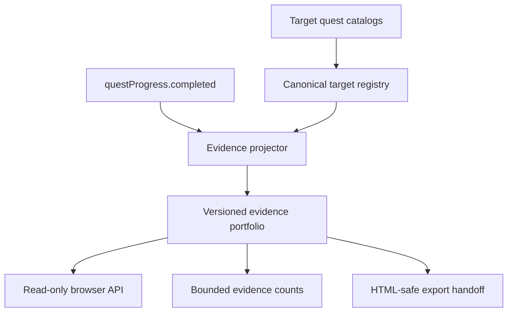

# Target Evidence Portfolio Plan

## Summary

Build a derived, export-ready evidence portfolio from completed quest summaries. The portfolio will group evidence by skill, equipment, and talent, expose a browser API for future Claude-owned UI, and enrich agent context with evidence counts without silently publishing private summaries.

---

## Problem Frame

ulong RPG currently records a written summary for every completed target quest, but those summaries remain trapped inside `questProgress.completed`. The showcase communicates self-assessed levels and links, while the strongest human-readable proof of learning is not represented in a stable data contract.

The target quest catalogs already provide the missing context: canonical target identity, authored quest title, level, sequence, and learning links. A derived portfolio can join completion records to those catalogs without introducing another mutable store or changing the fixed target quest schema.

---

## Requirements

- R1. Derive portfolio evidence from the current `questProgress.completed` records; do not create a second source of truth.
- R2. Group resolvable target quest completions by canonical target kind and target id.
- R3. Enrich each evidence item with target name, authored quest metadata, level or intro stage, summary, completion time, job context, and learning links when available.
- R4. Preserve legacy job-owned quest completions and malformed or unresolvable records in explicit fallback collections instead of silently dropping them.
- R5. Produce deterministic ordering and a versioned, JSON-compatible output suitable for export and later rendering.
- R6. Provide HTML-safe portfolio serialization so a future consented integration cannot terminate its JSON script element or inject markup.
- R7. Expose a small read-only browser API that always derives from live state and cached target catalogs.
- R8. Add bounded evidence counts to `window.ulongAgent.get_context()` without injecting full summaries into the AUTO prompt.
- R9. Provide an HTML-safe serializer for future showcase integration, but do not publish summaries until a visible Claude-owned presentation and disclosure exists.
- R10. Keep the existing cards, quest UI, export modal, and generated showcase visuals unchanged.
- R11. Document the contract and Codex-to-Claude handoff with automated unit and integration coverage.

---

## Scope Boundaries

### Included

- Pure evidence projection and safe HTML serialization logic.
- Mapping of runtime synthetic quest ids to authored target quest entries.
- Explicit legacy and unresolved evidence buckets.
- Browser API, agent context summary, and export-ready safe serialization.
- Contract documentation and tests.

### Excluded

- Visible evidence cards, filters, timelines, badges, or recruiter-facing copy.
- AI grading, scoring, rewriting, or validation of user summaries.
- New quest fields or changes to `levels: { "1": [...], "2": [...], "3": [...] }`.
- New localStorage keys or migration of existing progress.
- Changes to legacy quest authoring or Fundamental Dependency Graph PR #5.

### Deferred to Follow-Up Work

- Claude-owned presentation of evidence inside the app or public showcase.
- Optional proof URLs uploaded by the player.
- Role readiness calculations that weight evidence quality or coverage.

---

## Context & Research

### Relevant Code and Patterns

- `index.html` stores target quest completion records in `questProgress.completed`, requiring a non-empty summary.
- `index.html` creates stable runtime ids through the existing item and daily quest id helpers and caches target quest catalogs by kind.
- `buildExportHTML()` already loads data asynchronously before calling `generateShowcaseHTML()`, so evidence derivation can join that flow without changing export interaction.
- `scripts/lib/target-quest-health.mjs` demonstrates pure ESM data analysis with deterministic reports and dedicated Node tests.
- `scripts/lib/ulong-agent-bridge.mjs` and `window.ulongAgentReady` establish the browser-ready API pattern and bounded dynamic context.
- `docs/ideation/2026-07-22-surprise-me-ulong-rpg.md` ranks Target Evidence Portfolio as the strongest independent unimplemented data/logic idea after the completed health report and the still-open dependency graph work.

### Institutional Learnings

- The project boundary remains explicit: Codex owns data and logic contracts; Claude owns visible UI design.
- Derived data should not be duplicated in localStorage when it can be rebuilt from quest progress and catalogs.
- Agent context must remain bounded; counts belong in context, full evidence remains discoverable through a separate API.

---

## Assumptions

- A target completion id uses the current runtime forms for main quests and intro quests; records outside those forms are preserved rather than guessed.
- Evidence ordering should be deterministic by target identity and completion timestamp so repeated exports are reviewable.
- Hidden showcase metadata is not an acceptable publication surface for user-written summaries; export integration waits for visible Claude-owned presentation and disclosure.
- Catalog loading failures should produce a degraded portfolio whose completion records remain in `unresolved`; only module initialization failure may reject the direct API.

---

## Key Technical Decisions

- **Derived projection, not persistence:** quest progress remains authoritative and portfolio output is rebuilt on demand.
- **Canonical target registry:** normalize app kind `equip` to public kind `equipment`, then index all catalog targets before resolving completions.
- **Loss-aware fallbacks:** separate legacy quest evidence from unresolved target-shaped records so future migrations remain possible.
- **Safe export handoff:** provide HTML-safe serialization for the later consented showcase integration, without inserting summaries into current public output.
- **Bounded agent integration:** expose only portfolio summary counts in dynamic agent context, while the browser API returns full evidence on explicit request.

---

## High-Level Technical Design

> This illustrates the intended data flow and is directional guidance for review, not implementation specification.

---

## Implementation Units

- U1. **Pure Evidence Projection**

**Goal:** Convert quest completion state and target catalogs into a deterministic, loss-aware portfolio.

**Requirements:** R1, R2, R3, R4, R5, R6

**Dependencies:** None

**Files:**
- Create: `scripts/lib/target-evidence-portfolio.mjs`
- Create: `scripts/target-evidence-portfolio.test.mjs`

**Approach:**
- Build a normalized registry from the 3 target catalog kinds.
- Parse only recognized synthetic completion ids and resolve their authored intro or level quest.
- Preserve legacy ids and target-shaped records that cannot be resolved in separate collections.
- Return stable summary totals, sorted target groups, and safe serialization for an HTML script element.

**Patterns to follow:**
- Pure report construction and deterministic sorting in `scripts/lib/target-quest-health.mjs`.
- JSON validation posture in `scripts/lib/ulong-agent-bridge.mjs`.

**Test scenarios:**
- Happy path: intro and level completions across skill, equipment, and talent resolve to canonical targets with authored metadata.
- Happy path: multiple records for one target group together in deterministic completion order.
- Edge case: legacy job quest ids remain available in the legacy collection.
- Edge case: target-shaped ids with missing catalog targets or missing quest indices remain available in the unresolved collection with a reason.
- Edge case: missing summaries are not counted as valid evidence and remain diagnosable.
- Error path: malformed catalogs and completion containers produce a safe empty or fallback result without mutating inputs.
- Security: summaries containing closing script markup serialize without creating a literal closing script sequence.

**Verification:**
- Pure tests prove resolution, fallback preservation, determinism, input immutability, and safe serialization.

---

- U2. **Browser, Agent, and Showcase Integration**

**Goal:** Make the derived portfolio available to browser agents and prepare a safe future export handoff while preserving current public output.

**Requirements:** R7, R8, R9, R10

**Dependencies:** U1

**Files:**
- Modify: `index.html`
- Modify: `scripts/target-evidence-portfolio.test.mjs`
- Modify: `scripts/ulong-agent-bridge.test.mjs`

**Approach:**
- Reuse cached target quest loaders to build a live portfolio on demand.
- Publish a frozen read-only browser capability with an explicit readiness promise.
- Extend dynamic agent context with portfolio summary counts only.
- Keep generated showcase HTML free of hidden summaries until a visible disclosure and presentation flow exists.

**Patterns to follow:**
- `window.ulongAgentReady` initialization and failure handling.
- Existing asynchronous catalog loading in `buildExportHTML()`.
- Existing static extraction tests for behavior embedded in `index.html`.

**Test scenarios:**
- Integration: browser API readiness exposes a portfolio builder and does not expose mutation methods.
- Integration: agent context contains evidence totals but not completed summary text.
- Security: generated showcase HTML does not silently contain quest summary evidence.
- Edge case: empty quest progress returns a valid empty portfolio through the browser API.
- Error path: missing catalogs produce a degraded portfolio with unresolved evidence, while module initialization failure is reported without blocking normal app rendering or the existing visual export.
- Regression: export controls, bridge resources, and visible showcase markup remain unchanged.

**Verification:**
- Node integration tests and a headless browser smoke test prove live derivation, bounded agent context, and unchanged public showcase output.

---

- U3. **Contract and Ideation Handoff**

**Goal:** Document the evidence schema, consumer boundary, and selected idea status for future Claude UI work.

**Requirements:** R11

**Dependencies:** U1, U2

**Files:**
- Create: `docs/architecture/target-evidence-portfolio.md`
- Modify: `README.md`
- Modify: `docs/ideation/2026-07-22-surprise-me-ulong-rpg.md`

**Approach:**
- Document canonical kinds, target groups, evidence entries, legacy/unresolved handling, browser usage, and the consent requirement for showcase integration.
- Mark Target Evidence Portfolio as selected and implemented without rewriting prior idea rankings.
- Keep visible UI ownership explicitly deferred to Claude.

**Test scenarios:**
- Documentation: usage examples match exported capability names and the serializer boundary asserted by tests.
- Regression: ideation history still records previously selected ideas and PR #5 remains described as separate open work.

**Verification:**
- Documentation references only shipped APIs and repo-relative paths.

---

## System-Wide Impact

- **Interaction graph:** quest completion state and target catalogs feed a pure projector; current consumers are the browser API and bounded agent context, with a serializer prepared for future export work.
- **Error propagation:** direct browser API calls reject on module/catalog failures; normal app startup and visible rendering continue.
- **State lifecycle risks:** no new persistent state exists, so stale portfolio data is avoided by deriving on every explicit build.
- **API surface parity:** portfolio is read-only because it is derived; mutations continue through `questProgress` on `window.ulongAgent`.
- **Integration coverage:** browser verification must prove state changes are reflected in a subsequent portfolio build, context remains bounded, and generated showcase HTML does not leak summaries.
- **Unchanged invariants:** target quest schema, quest completion requirements, localStorage keys, UI layout, and showcase visuals remain unchanged.

---

## Risks & Dependencies

| Risk | Mitigation |
|---|---|
| Runtime synthetic ids differ from authored quest ids | Resolve through the existing id convention and catalog level/index position; preserve unresolved records. |
| User summaries inject markup into future exported HTML | Provide dedicated HTML-safe JSON serialization and a security regression test before any visible integration. |
| Full evidence bloats AUTO context | Include only summary counts in context; full data requires an explicit browser API call. |
| Catalog loading failure loses evidence | Preserve completion records as unresolved evidence; module initialization remains independent from the existing visual export. |
| PR #5 changes target metadata concurrently | Depend only on fields already present on `main`; do not consume dependency graph fields. |

---

## Documentation / Operational Notes

- No data migration or rollout flag is required because the portfolio is derived.
- The public contract is versioned so a future visible evidence UI can evolve deliberately.
- Browser testing must use an isolated `agent-browser` session and must not connect to or close the user's Chrome `9222` tabs.

---

## Sources & References

- Ideation origin: `docs/ideation/2026-07-22-surprise-me-ulong-rpg.md`
- Quest data handoff: `docs/handoffs/target-quest-data-for-claude.md`
- Existing health analysis: `scripts/lib/target-quest-health.mjs`
- Existing agent contract: `docs/architecture/agent-capability-map.md`
- Existing showcase generator: `index.html`
